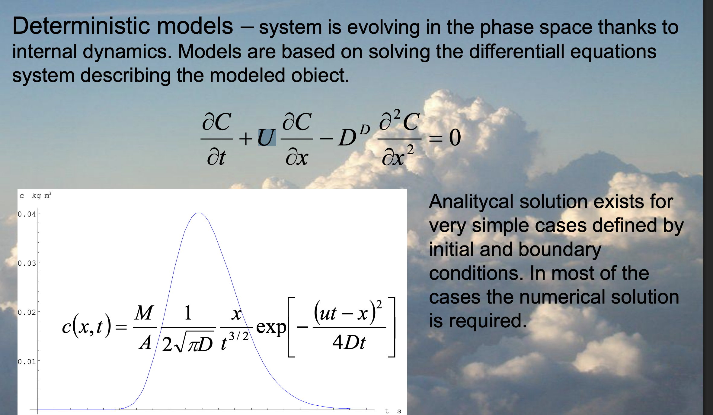

Create a Jupyter notebook reproducing the c(x,t) analytic solution plot from from Lecture 1 slide 13.

Use pint and matplotlib in a way that units consistent with the lecture plot are automatically
labelled on the graph. Pick constant values to match the axes ranges and shape.
The final pdf must include your full name. I expect the picked parameters to be individually chosen.

Create a GitHub Action executing the notebook (see https://nbconvert.readthedocs.io/) 
and uploading the resultant pdf as an action artifact (see https://github.com/actions/upload-artifact).

Scoring:
- 20% narrative explaining the mathematical model, the type of solution, and the context (given units on the axes)
- 20% Python script implementing the analytic solution
- 20% choice of parameters and their units
- 20% Python script creating the plot with units automatically handled by pint
- 20% automation leading to vector graphics plot embedded in the pdf uploaded as artifact

Submission: sending the location of the repository by e-mail to sylwester.arabas@agh.edu.pl